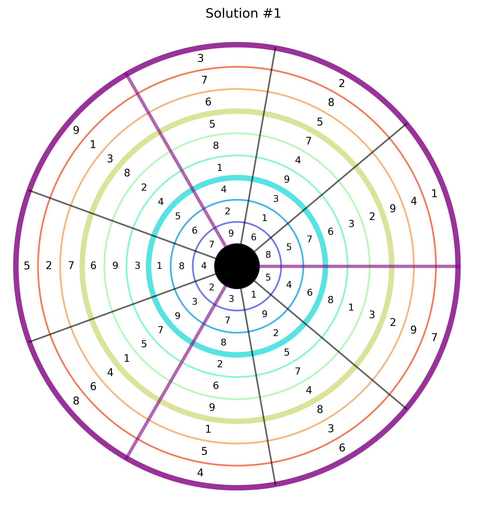

# Annular Sudoku

A simple Sudoku generator and solver. It can create Sudoku puzzles, solve them, and export results to PDF.

## Usage
This command generates **5 Sudoku puzzles** and saves them into `example/output.pdf`.

```bash
python annular_gen.py --count 5 --out example
```


## Examples

Check the `example/` folder for sample outputs:

* `example/output.pdf` – multiple Sudoku puzzles
* `example/sudoku_1.png` – a single Sudoku puzzle
* `example/sudoku_1_solution.png` – the corresponding solution

<table align="center">
  <tr>
    <td align="center">
      <br/>
      <small>Example annular sudoku</small>
    </td>
    <td align="center">
      <br/>
      <small>Example annular sudoku solution</small>
    </td>
  </tr>
</table>


## Requirements

* Python 3.8+
* matplotlib

Install dependencies:

```bash
pip install -r requirements.txt
```

## License

MIT
